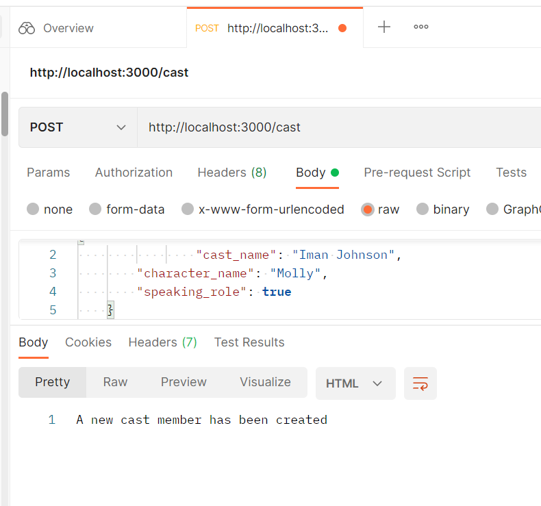
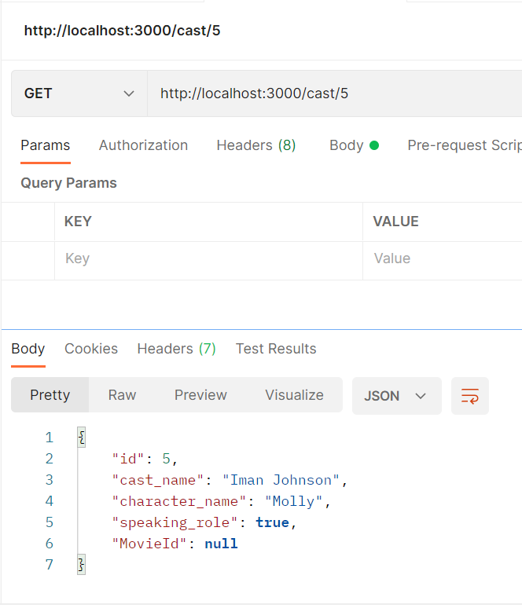
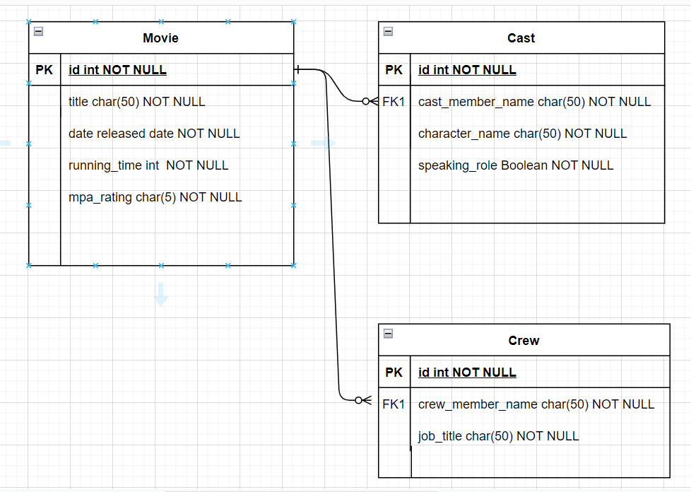
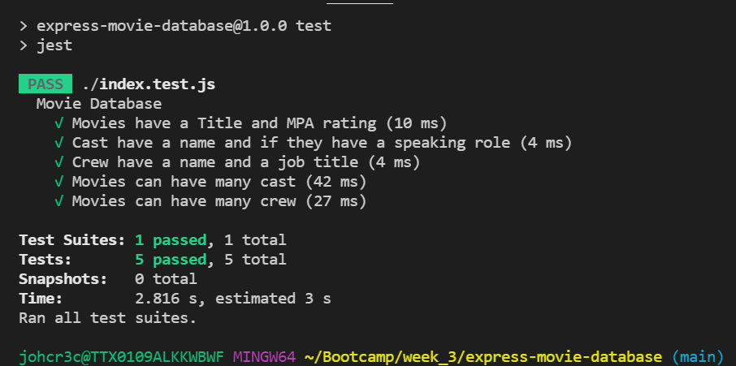
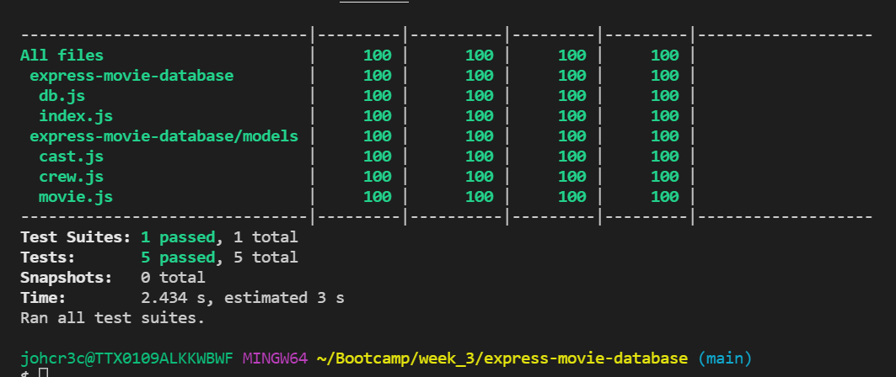

# express-movie-database

  
  

# The goal of this project is to: 

Create an API that allows users to interact with our movie database.  Users are able to:
1. Read all database entities. 
2. Select entities by id. 
3. Delete database entities by id. 
4. Create new database entities. 
5. Update database entities by id. 

# Technologies Used:
<ul>
<li>Jest</li>
<li>Sequelize</li>
<li>SQLite 3</li>
<li>Express</li>
<li>Postman</li>
</ul>

# Project Planning                                                              

  
  

                                                                                                          
# Testing

  
  

                                                     
# Getting Started

Fork and clone this repository then run <code class="w3-codespan">npm install</code> to add the relevant dependencies. Run <code class="w3-codespan">npm run test</code> to seed the database and confirm tests pass. Finally, run <code class="w3-codespan">npm run app.js</code> to run the express server and interact with the Routes using <a href="https://www.postman.com/">Postman</a>.

# Contribution Guidelines

To make suggestions, create a new issue on this repo.
